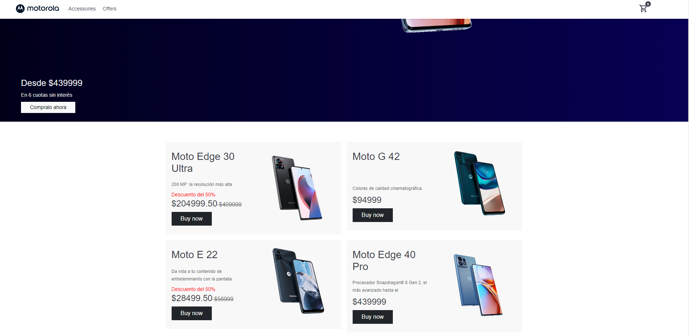

### Descripción:

Este repositorio es un ejemplo de ecommerce con productos de Motorola desarrollado con React, una base de datos creada en Firebase y la biblioteca React Bootstrap. Este proyecto fue realizado con: `npm create vite@latest`.

 - Para instalar las dependecias  del proyecto debe escribir en la consola: `npm install`
 - Y luego para iniciar en el proyecto ejecutar: `npm run dev`
 - Ir a http://localhost:5173/

- Plan B: entrar directamente al link del sitio, alojado en Netlify: https://simulacroecommercemoto.netlify.app/
